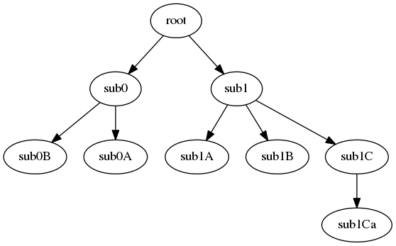

Export to DOT
=============

Any :any:`anytree` graph can be converted to a graphviz_ graph.

This tree::

    >>> from anytree import Node
    >>> root = Node("root")
    >>> s0 = Node("sub0", parent=root)
    >>> s0b = Node("sub0B", parent=s0)
    >>> s0a = Node("sub0A", parent=s0)
    >>> s1 = Node("sub1", parent=root)
    >>> s1a = Node("sub1A", parent=s1)
    >>> s1b = Node("sub1B", parent=s1)
    >>> s1c = Node("sub1C", parent=s1)
    >>> s1ca = Node("sub1Ca", parent=s1c)

Can be rendered to a tree by :any:`RenderTreeGraph`::

    >>> from anytree.dotexport import RenderTreeGraph
    >>> RenderTreeGraph(root).to_picture("tree.png")  # doctest: +SKIP

.. automodule:: anytree.dotexport
    :inherited-members:

.. _graphviz: http://www.graphviz.org/
