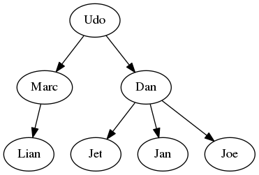
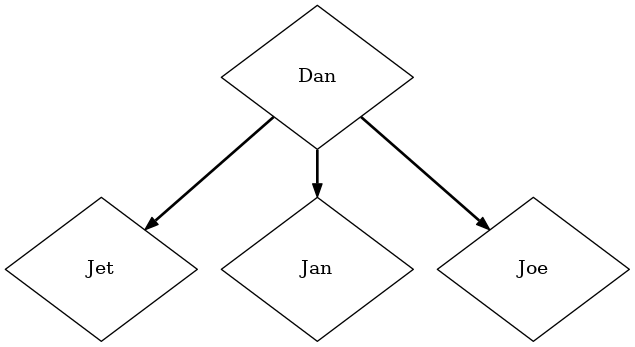

********************
Any Python Tree Data
********************

.. image:: https://badge.fury.io/py/anytree.svg
    :target: https://badge.fury.io/py/anytree

.. image:: https://img.shields.io/pypi/dm/anytree.svg?label=pypi%20downloads
   :target: https://pypi.python.org/pypi/anytree

.. image:: https://readthedocs.org/projects/anytree/badge/?version=latest
    :target: https://anytree.readthedocs.io/en/latest/?badge=latest

.. image:: https://coveralls.io/repos/github/c0fec0de/anytree/badge.svg
    :target: https://coveralls.io/github/c0fec0de/anytree

.. image:: https://readthedocs.org/projects/anytree/badge/?version=stable
    :target: https://anytree.readthedocs.io/en/stable/

.. image:: https://img.shields.io/pypi/pyversions/anytree.svg
   :target: https://pypi.python.org/pypi/anytree

.. image:: https://img.shields.io/github/contributors/c0fec0de/anytree.svg
   :target: https://github.com/c0fec0de/anytree/graphs/contributors/

.. image:: https://img.shields.io/badge/PRs-welcome-brightgreen.svg?style=flat-square
   :target: http://makeapullrequest.com

.. image:: https://img.shields.io/github/issues-pr/c0fec0de/anytree.svg
   :target: https://github.com/c0fec0de/anytree/pulls

.. image:: https://img.shields.io/github/issues-pr-closed/c0fec0de/anytree.svg
   :target: https://github.com/c0fec0de/anytree/pulls?q=is%3Apr+is%3Aclosed

Simple, lightweight and extensible Tree_ data structure.

Feel free to share_ info about your anytree project.

.. _share: https://github.com/c0fec0de/anytree/issues/34

.. toctree::
   :maxdepth: 2

   installation
   intro
   api
   importer
   exporter
   tricks

Links
=====

* Documentation_
* GitHub_
* PyPI_
* Changelog_
* Issues_
* Contributors_
* If you enjoy anytree_

  .. image:: https://cdn.buymeacoffee.com/buttons/default-orange.png
     :width: 150
     :target: https://www.buymeacoffee.com/1oYX0sw

Feel free to share_ info about your anytree project.

.. _anytree: https://anytree.readthedocs.io/en/stable/
.. _Documentation: https://anytree.readthedocs.io/en/stable/
.. _GitHub: https://github.com/c0fec0de/anytree
.. _PyPI: https://pypi.org/project/anytree/
.. _Changelog: https://github.com/c0fec0de/anytree/releases
.. _Issues: https://github.com/c0fec0de/anytree/issues
.. _Contributors: https://github.com/c0fec0de/anytree/graphs/contributors
.. _share: https://github.com/c0fec0de/anytree/issues/34
.. _Tree: https://en.wikipedia.org/wiki/Tree_(data_structure)

Getting started
===============

.. _getting_started:

Usage is simple.

**Construction**

>>> from anytree import Node, RenderTree
>>> udo = Node("Udo")
>>> marc = Node("Marc", parent=udo)
>>> lian = Node("Lian", parent=marc)
>>> dan = Node("Dan", parent=udo)
>>> jet = Node("Jet", parent=dan)
>>> jan = Node("Jan", parent=dan)
>>> joe = Node("Joe", parent=dan)

**Node**

>>> print(udo)
Node('/Udo')
>>> print(joe)
Node('/Udo/Dan/Joe')

**Tree**

>>> for pre, fill, node in RenderTree(udo):
...     print("%s%s" % (pre, node.name))
Udo
├── Marc
│   └── Lian
└── Dan
    ├── Jet
    ├── Jan
    └── Joe

For details see :any:`Node` and :any:`RenderTree`.

**Visualization**

>>> from anytree.exporter import UniqueDotExporter
>>> # graphviz needs to be installed for the next line!
>>> UniqueDotExporter(udo).to_picture("udo.png") # doctest: +SKIP

The :any:`UniqueDotExporter` can be started at any node and has various formatting hookups:

>>> UniqueDotExporter(dan,
...                   nodeattrfunc=lambda node: "fixedsize=true, width=1, height=1, shape=diamond",
...                   edgeattrfunc=lambda parent, child: "style=bold"
... ).to_picture("dan.png") # doctest: +SKIP

**Manipulation**

A second tree:

>>> mary = Node("Mary")
>>> urs = Node("Urs", parent=mary)
>>> chris = Node("Chris", parent=mary)
>>> marta = Node("Marta", parent=mary)
>>> print(RenderTree(mary))
Node('/Mary')
├── Node('/Mary/Urs')
├── Node('/Mary/Chris')
└── Node('/Mary/Marta')

Append:

>>> udo.parent = mary
>>> print(RenderTree(mary))
Node('/Mary')
├── Node('/Mary/Urs')
├── Node('/Mary/Chris')
├── Node('/Mary/Marta')
└── Node('/Mary/Udo')
    ├── Node('/Mary/Udo/Marc')
    │   └── Node('/Mary/Udo/Marc/Lian')
    └── Node('/Mary/Udo/Dan')
        ├── Node('/Mary/Udo/Dan/Jet')
        ├── Node('/Mary/Udo/Dan/Jan')
        └── Node('/Mary/Udo/Dan/Joe')

Subtree rendering:

>>> print(RenderTree(marc))
Node('/Mary/Udo/Marc')
└── Node('/Mary/Udo/Marc/Lian')

Cut/Delete:

>>> dan.parent = None
>>> print(RenderTree(dan))
Node('/Dan')
├── Node('/Dan/Jet')
├── Node('/Dan/Jan')
└── Node('/Dan/Joe')

>>> print(RenderTree(mary))
Node('/Mary')
├── Node('/Mary/Urs')
├── Node('/Mary/Chris')
├── Node('/Mary/Marta')
└── Node('/Mary/Udo')
    └── Node('/Mary/Udo/Marc')
        └── Node('/Mary/Udo/Marc/Lian')

**Extending any python class to become a tree node**

The entire tree magic is encapsulated by :any:`NodeMixin`,
add it as base class and the class becomes a tree node:

>>> from anytree import NodeMixin, RenderTree
>>> class MyBaseClass(object):  # Just an example of a base class
...     foo = 4
>>> class MyClass(MyBaseClass, NodeMixin):  # Add Node feature
...     def __init__(self, name, length, width, parent=None, children=None):
...         super(MyClass, self).__init__()
...         self.name = name
...         self.length = length
...         self.width = width
...         self.parent = parent
...         if children:  # set children only if given
...             self.children = children

Just set the `parent` attribute to reflect the tree relation:

>>> my0 = MyClass('my0', 0, 0)
>>> my1 = MyClass('my1', 1, 0, parent=my0)
>>> my2 = MyClass('my2', 0, 2, parent=my0)

>>> for pre, fill, node in RenderTree(my0):
...     treestr = u"%s%s" % (pre, node.name)
...     print(treestr.ljust(8), node.length, node.width)
my0      0 0
├── my1  1 0
└── my2  0 2

The `children` can be used likewise:

>>> my0 = MyClass('my0', 0, 0, children=[
...     MyClass('my1', 1, 0),
...     MyClass('my2', 0, 2),
... ])

>>> for pre, fill, node in RenderTree(my0):
...     treestr = u"%s%s" % (pre, node.name)
...     print(treestr.ljust(8), node.length, node.width)
my0      0 0
├── my1  1 0
└── my2  0 2
