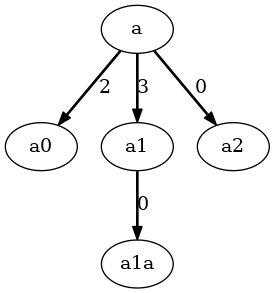

Weighted Edges
==============

**Application**: Add weight to edges and make use of them.

As every node has just one parent, the easiest way to handle edge weights is to
store them in the child node.
If a child node is detached from its parent, the weight attribute can be cleared
automatically by `Node._post_detach`.

>>> from anytree import NodeMixin, RenderTree
>>> class WNode(NodeMixin):
...
...     def __init__(self, foo, parent=None, weight=None):
...         super(WNode, self).__init__()
...         self.foo = foo
...         self.parent = parent
...         self.weight = weight if parent is not None else None
...
...     def _post_detach(self, parent):
...         self.weight = None

An example tree:

>>> a = WNode("a")
>>> a0 = WNode("a0", parent=a, weight=2)
>>> a1 = WNode("a1", parent=a, weight=3)
>>> a1a = WNode("a1a", parent=a1)
>>> a2 = WNode("a2", parent=a)
>>> for pre, _, node in RenderTree(a):
...     print("%s%s (%s)" % (pre, node.foo, node.weight or 0))
a (0)
├── a0 (2)
├── a1 (3)
│   └── a1a (0)
└── a2 (0)

>>> from anytree.exporter import DotExporter
>>> DotExporter(a,
...             nodenamefunc=lambda node: node.foo,
...             edgeattrfunc=lambda parent, child: "style=bold,label=%d" % (child.weight or 0)
... ).to_picture("weight.png")  # doctest: +SKIP

